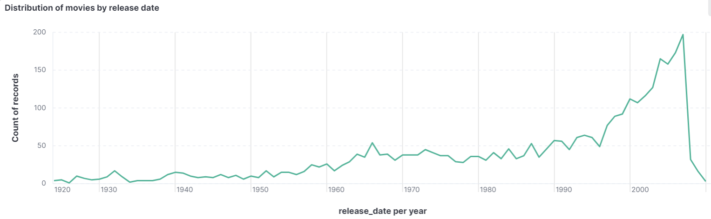

<!-- Add your project title and badges -->
# Real-Time Movie Recommender 🍿

[](https://github.com/omardbaa/Real-Time-Movie-Recommender-Powered-by-Elasticsearch-and-Kibana/blob/main/LICENSE)
[](https://www.python.org/downloads/release/python-380/)
[](https://www.elastic.co/downloads/past-releases/elasticsearch-8-11-0)
[](https://www.elastic.co/downloads/past-releases/kibana-8-11-0)
[](https://kafka.apache.org/downloads)
[](https://zookeeper.apache.org/releases.html#download)
[](https://spark.apache.org/downloads.html)
[](https://hadoop.apache.org/releases.html)

Welcome to the Real-Time Movie Recommender powered by Elasticsearch and Kibana. This project offers a cutting-edge recommendation system for movies using real-time data processing, storage, and visualization.

## Table of Contents
- [Real-Time Movie Recommender 🍿](#real-time-movie-recommender-)
  - [Table of Contents](#table-of-contents)
  - [Overview](#overview)
  - [Features](#features)
  - [Getting Started](#getting-started)
    - [Producer 🎬](#producer-)
      - [Steps and Logic:](#steps-and-logic)
      - [Notes:](#notes)
    - [Consumer 📥](#consumer-)
      - [Steps and Logic:](#steps-and-logic-1)
      - [Notes:](#notes-1)
  - [Usage](#usage)
  - [Architecture](#architecture)
  - [API](#api)
    - [Endpoints](#endpoints)
  - [Methods and Logic](#methods-and-logic)
    - [`get_paginated_movies(page=1, page_size=10)` 🎥](#get_paginated_moviespage1-page_size10-)
    - [`get_movie_details(title)` 📽️](#get_movie_detailstitle-️)
    - [`get_recommendations()` 🎞️](#get_recommendations-️)
    - [`find_similar_movies(movie_details)` 🍿](#find_similar_moviesmovie_details-)
    - [HTML Templates (`index.html`) 🖥️](#html-templates-indexhtml-️)
  - [Application Flow](#application-flow)
  - [Visualization](#visualization)
    - [Distribution of movies by release date](#distribution-of-movies-by-release-date)
    - [Top 10 popular movies](#top-10-popular-movies)
    - [Average rating per genre](#average-rating-per-genre)
    - [Linguistic distribution of movies](#linguistic-distribution-of-movies)
    - [Top 10 movies with the most votes](#top-10-movies-with-the-most-votes)
  - [Contributing](#contributing)
  - [License](#license)

## Overview
The Real-Time Movie Recommender is an advanced system that leverages Elasticsearch for data storage and Kibana for data visualization. It provides real-time movie recommendations based on user preferences, enhancing the user experience on streaming platforms.

## Features
- Real-time movie recommendations leveraging Elasticsearch.
- User-friendly API for personalized suggestions.
- Interactive visualization of movie insights using Kibana.

## Getting Started
1. **Clone the repository:**
    ```bash
    git clone https://github.com/omardbaa/Real-Time-Movie-Recommender-Powered-by-Elasticsearch-and-Kibana
    ```
2. **Install dependencies:**
    ```bash
    pip install -r requirements.txt
    ```
3. **Configure Elasticsearch and Kibana:**
    - [Documentation link or steps to configure Elasticsearch and Kibana]

4. **Run the application:**
    ```bash
    python app.py
    ```

### Producer 🎬
Fetches movie data from the TMDB API and sends it to a Kafka topic for real-time processing.

#### Steps and Logic:
| Step | Description |
| ---- | ----------- |
| 1.   | Setup Kafka Producer. |
| 2.   | Fetch Movie Data. |
| 3.   | Send Data to Kafka. |
| 4.   | Error Handling. |
| 5.   | Batch Processing. |

#### Notes:
- The script runs continuously to fetch data in real-time.
- It uses the `requests` library to interact with the TMDB API.
- Data is produced to the Kafka topic "movie_recommendation" for downstream processing.

### Consumer 📥
Reads movie data from the Kafka topic and stores it into Elasticsearch for storage and retrieval.

#### Steps and Logic:
| Step | Description |
| ---- | ----------- |
| 1.   | Initialize Spark Session. |
| 2.   | Read Data from Kafka. |
| 3.   | Schema Definition. |
| 4.   | Process and Transform Data. |
| 5.   | Write Data to Elasticsearch. |
| 6.   | Console Output (Optional). |
| 7.   | Termination. |

#### Notes:
- PySpark is utilized to consume, transform, and store data into Elasticsearch.
- The script utilizes Spark Structured Streaming to process real-time data.
- Data is structured according to the defined schema before writing to Elasticsearch.

## Usage
- **API Usage:**
    - To get movie recommendations, make a GET request to `/recommendations` with the movie title as a query parameter.
    - Example:
        ```bash
        curl -X GET "http://localhost:5000/recommendations?title=Avengers"
        ```

## Architecture

The Real-Time Movie Recommender architecture involves Elasticsearch as the data store, Kibana for data visualization, and Spark/Kafka  for real-time data processing.

## API
### Endpoints
- **GET /recommendations**
  - Description: Fetches movie recommendations based on a given movie title.
  - Parameters: `title` (string)
  - Example: `/recommendations?title=Avengers`
  - Response: A JSON object containing recommended movies.

## Methods and Logic

### `get_paginated_movies(page=1, page_size=10)` 🎥
- **Purpose**: Retrieves a paginated list of movies from Elasticsearch.
- **Parameters**: 
  - `page`: Current page number (default: 1)
  - `page_size`: Number of movies per page (default: 10)
- **Logic**:
  - Constructs an Elasticsearch query to fetch movies sorted by popularity.
  - Returns a subset of movies based on pagination settings.

### `get_movie_details(title)` 📽️
- **Purpose**: Fetches details of a movie based on its title from Elasticsearch.
- **Parameter**: `title`: Title of the movie to search for.
- **Logic**:
  - Constructs an Elasticsearch query to find a movie matching the provided title.
  - Returns details of the movie if found, otherwise returns `None`.

### `get_recommendations()` 🎞️
- **Purpose**: Serves the `/recommendations` endpoint in Flask.
- **Logic**:
  - Retrieves details of a searched movie using `get_movie_details()`.
  - Finds similar movies based on the searched movie's details using `find_similar_movies()`.
  - Fetches a paginated list of movies using `get_paginated_movies()`.
  - Renders an HTML template with details of the searched movie and its similar movies.

### `find_similar_movies(movie_details)` 🍿
- **Purpose**: Finds similar movies based on the details of a given movie.
- **Parameter**: `movie_details`: Details of the movie for which similar movies are to be found.
- **Logic**:
  - Extracts specific details like `title`, `genres`, `popularity`, `vote_average`, and `collections` from the provided movie details.
  - Constructs an Elasticsearch query using these details to search for similar movies.
  - Returns a list of similar movies excluding the current movie title.

### HTML Templates (`index.html`) 🖥️
- **Purpose**: Renders the frontend view of movies and recommendations.
- **Features**:
  - Displays details of the searched movie, its poster, release date, genres, popularity, and vote average.
  - Shows a list of recommended similar movies with their details.
  - Includes pagination controls for navigation through the list of movies.

---

## Application Flow

1. User accesses the `/recommendations` endpoint with a movie title.
2. Server fetches details of the searched movie and its recommendations.
3. Server renders the HTML template with details of the searched movie and recommended similar movies.
4. Frontend displays the movie details, recommendations, and pagination controls.


## Visualization

### Distribution of movies by release date



### Top 10 popular movies


### Average rating per genre


### Linguistic distribution of movies


### Top 10 movies with the most votes


## Contributing
Contributions are welcome! 

## License
This project is licensed under the [MIT License](LICENSE) - see the [LICENSE](LICENSE) file for more details.
